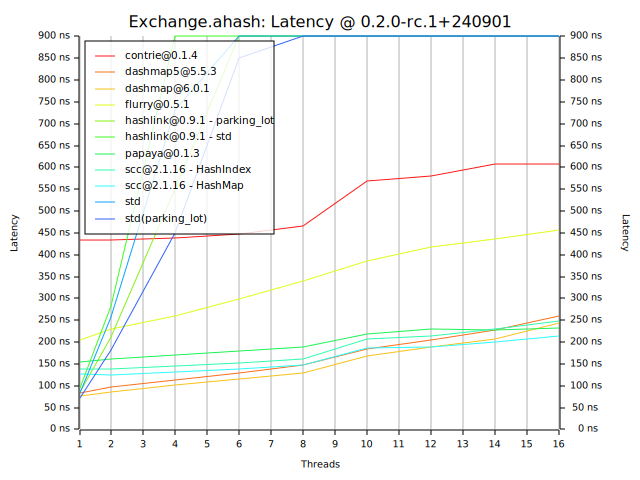

# conc-map-bench

conc-map-bench uses the bustle benchmarking harness. This is a port of the well regarded libcuckoo benchmark.

This fork version is modified slightly.

- Include more conc maps(thanks to macros it's easy to do so).
- Add mimalloc / jemalloc support.
- Update to Rust 2021 edition and use latest stable Rust.
- Pinned to specific versions of each maps and show the version in the results.

## Workloads

The benchmark measures performance under varying load conditions. This is done
because a map suitable for one workload may not be suitable for another.

### Read Heavy

A read heavy model with few inserts, removals and updates. Models caching of data in places such as webservers and disk page caches.

```text
read   98%
insert  1%
remove  1%
update  0%
```

### Exchange

Insert and remove heavy model that replicates a scenario where the map is used to exchange data.

```text
read    10%
insert  40%
remove  40%
update  10%
```

### Rapid Grow

An insert heavy model that replicates load in a scenario where the map is used to gather large amounts of data under a short burst.

```text
read    5%
insert 80%
remove  5%
update 10%
```

## How to run it?

You may use the scripts:

```sh
mv results results.bk
./scripts/bench.bash
./scripts/plot.bash
```

or simply (examples that enable mimalloc and ahash):

```sh
cargo build --release

mv results results.bk

./target/release/conc-map-bench bench -w ReadHeavy -h ahash --csv 2>>./results/mimalloc/ReadHeavy.ahash.csv
./target/release/conc-map-bench bench -w Exchange -h ahash --csv 2>>./results/mimalloc/Exchange.ahash.csv
./target/release/conc-map-bench bench -w RapidGrow -h ahash --csv 2>>./results/mimalloc/RapidGrow.ahash.csv

cat ./results/mimalloc/ReadHeavy.ahash.csv | ./target/release/conc-map-bench plot ./results/mimalloc ReadHeavy.ahash --latency-limit-ns 900
cat ./results/mimalloc/Exchange.ahash.csv | ./target/release/conc-map-bench plot ./results/mimalloc Exchange.ahash --latency-limit-ns 900
cat ./results/mimalloc/RapidGrow.ahash.csv | ./target/release/conc-map-bench plot ./results/mimalloc RapidGrow.ahash --latency-limit-ns 900
```

## Results

Machine: Aoostar Mini PC, AMD Ryzen™ 7 8845HS, 32GB DDR5-5600 RAM

OS: Debian 12, Linux version 6.10.7-x64v4-xanmod1

See the `results/` directory.

Only tested with mimalloc enabled and ahasher.

### Read Heavy (ahash)

| | |
|:-:|:-:|
| | |

### Exchange (ahash)

| | |
|:-:|:-:|
| | |

### Rapid Grow (ahash)

| | |
|:-:|:-:|
| | |
